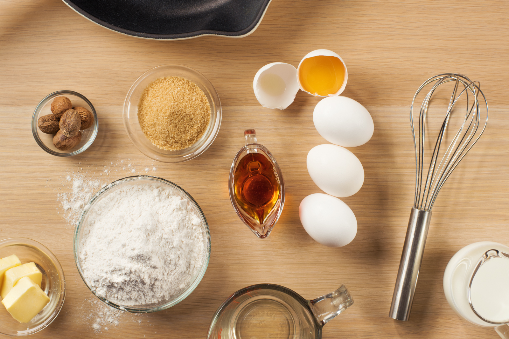

## Metric Mass to Imperial Volume Converter

 

  <button class="dropbtn">Dropdown</button>
  

    <a type="text" value="1">Link 1</a>
    <a type="text" value="2">Link 2</a>
    <a type="text" value="3">Link 3</a>
  

<h3>Add an Ingredient</h3>
<form>
    
<label>
        Name:
        <input type="text" name="name" id="name" required>
    </label>

    
<label>
        Density in grams per tsp:
        <input type="text" name="uid" id="uid" required>
    </label>

    

        <button>Create</button>
    

</form>